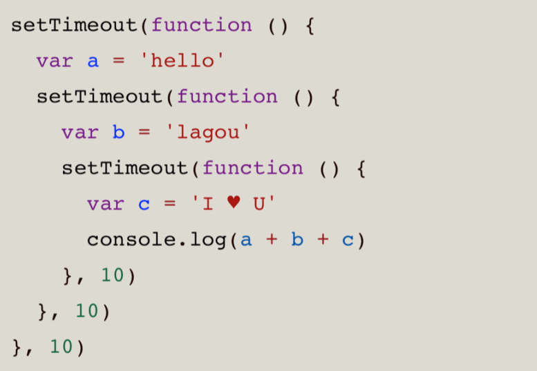

# fed-e-task-01-01
### 简答题
- 一、谈谈你是如何理解JS异步编程的，EventLoop、消息队列都是做什么的，什么是宏任务，什么是微任务？

  1. JavaScript起初作为浏览器脚本语言目是为了操作DOM实现交互，所以就使得它必须是单线程模式，否则会出现复杂的线程同步问题。但是当程序出现耗时就会导致程序阻塞（假死），为了解决这个问题JS将任务的执行模式分为两种：同步模式、异步模式；JS实现**异步模式**实际是JS的事件循环和消息队列，通常使用回调函数或者Promise的形式被放入事件队列，再由事件循环（EventLoop）机制在每次轮询时检查异步操作是否完成，若完成则按事件队列里面的执行规则来依次执行相应的任务。
   2. **EventLoop、消息队列**：当程序运行起来，会将同步任务压入执行栈然后执行，在这期间如果有异步任务则先将它的回调就会放入**消息队列**中等待执行。EventLoop负责监听调用栈和消息队列。当调用栈所有的任务都结束了，它就会从消息队列中取出第一个事件回调函数压入到调用栈执行。
   3. **宏任务**：每次执行栈执行的代码就是一个宏任务，每次从事件队列中获取的事件回调并放入执行栈中执行的也是宏任务。浏览器为了内部宏任务与DOM任务能够有序执行，会在一个宏任务执行结束后，在下一个宏任务开始执行前，先对页面进行渲染。宏任务包含：script标签代码、setTimeout、setInterval、I/O、UI交互事件、postMessage、MessageChannel、Nodejs中的setImmediate
   4. **微任务**：当前宏任务执行结束后，就会将在这执行期间产生的所有微任务都立即执行完毕，它的相应速度比setTimeout会更快，因为无需等待渲染。微任务包含：Promise.then、Object.observer、MutaionObserver、NodeJS中的process.nextTick

### 代码题
- 一、将下面异步代码使用Promise的方式改进

  
  
  [改进代码](./code/answer1.js)
- 二、基于下面代码完成下面的四个练习
  
  
  
  练习1：使用函数组合fp.flowRight()重新实现下面这个函数
  
  
  
  [练习1代码](./code/exercise1.js)
  
  练习2：使用fp.flowRight()、fp.prop()、fp.first()获取第一个car的name
  
  [练习2代码](./code/exercise2.js)
  
  练习3：使用帮助函数_average重构averageDollarValue，使用组合的方式实现
  
  [练习3代码](./code/exercise3.js)
  
  练习4：使用flowRight写一个sanitizeNames()函数，返回一个下划线链接的小写字符串，把数组中的name转换为这种形式：sanitizeNames(['Hello World']) => ['hello_world']

  [练习4代码](./code/exercise4.js)
- 三、基于下面提供的代码，完成后续的四个练习

  [提供代码support.js](./code/support.js)

  练习1：使用fp.add(x, y)和fp.map(f, x)创建一个能让functor里的值增加的函数ex1

  [练习1代码](./code/exercise5.js)

  练习2：实现一个函数ex2，能够使用fp.first获取列表的第一个元素

  [练习2代码](./code/exercise5.js)

  练习3：实现一个函数ex3，使用safeProp和fp.first找到user的名字的首字母

  [练习3代码](./code/exercise5.js)

  练习4：使用Maybe重写ex4，不要有if语句

  [练习4代码](./code/exercise5.js)